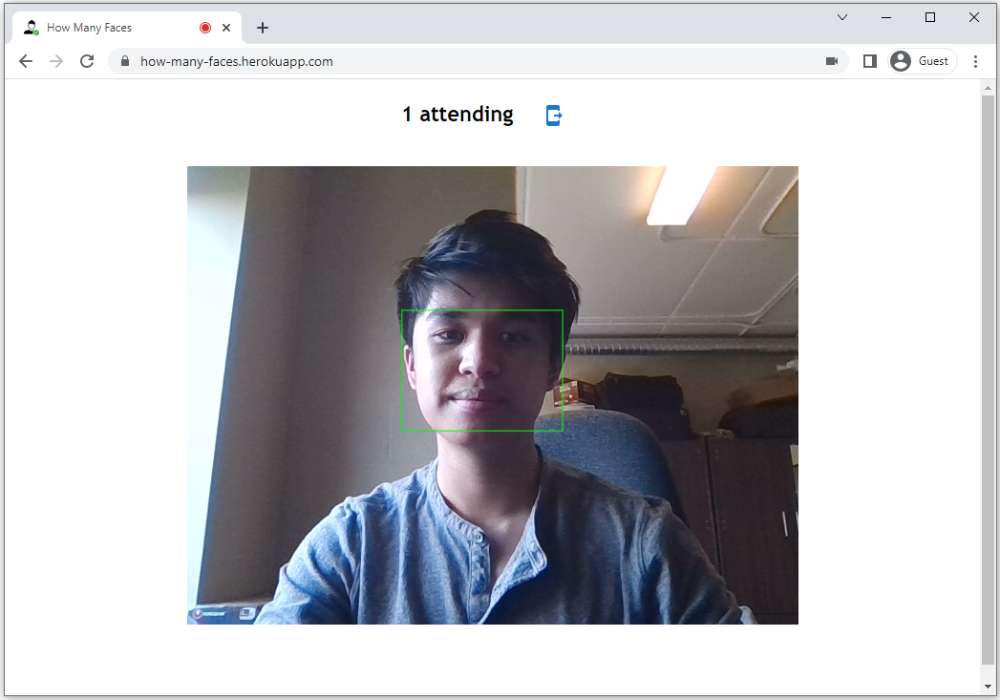

# How Many Faces

The app can be accessed [here](https://how-many-faces.herokuapp.com).

How Many Faces is a fullstack web application that offers a new way for teachers to take attendance of their classes. They simply need to point their device's camera towards their class, then the app will detect the number of human faces and send the user an SMS with an attendance report.

The site was created using [TensorFlow](https://www.tensorflow.org) to detect peoples' faces, as well as the [Twilio API](https://www.twilio.com) to send users SMS messages with their attendance reports.

## Inspiration

While in class, I often noticed that teachers waste a significant portion of their time taking attendance of their students. I understood that this process was important to ensure that students regularly attend class, but I believed that it could be optimized.

This lead to my idea of How Many Faces. By having users simply point their device's camera towards their classroom to determine how many students are currently attending, this process would be hugely optimized and reduce time wasted.

## Goals

After getting inspired, I developed 2 main goals for this app:

1. How Many Faces should be able to detect human faces with high accuracy, so teachers receive accurate attendance reports.

2. How Many Faces should offer a way for users to receive a copy of their attendance reports, so they can refer back to previous reports and compare numbers.

## Development

My first idea was to use TensorFlow to detect human faces from the device's camera. As such, I could deploy a convolutional neural network to classify human faces in images uploaded by users. Then, I could display relevant data for the user (how many faces were detected, where the faces are detected, etc.).

My second idea was to use the [Twilio API](https://www.twilio.com) so that users could receive copies of their attendance reports. Since Twilio enables the application to send SMS messages, teachers would simply need to enter their phone numbers into the app, before the app instantly sends them an SMS of their current attendance.

After that, I coded the front-end in React. I leveraged the React Webcam library to access users' cameras through the application. Then, I used Express to code the back-end, including an API endpoint for users to send themselves SMS messages with the Twilio API.

## Final Result

How Many Faces can be accessed [here](https://how-many-faces.herokuapp.com).

   
  

## Future Roadmap

There are some ways that How Many Faces can continue to be improved:

1. The app could offer an option for users to upload images from their own devices and count the human faces in such images. This would allow users to count the number of human faces in past events or lectures. Altogether, this would also be a simple feature to implement, since the same convolutional neural network that detects human faces could be deployed.

2. In terms of expanding the scope of this project, I could look into deploying other convolutional neural networks to detect things other than human faces. For example, I could consider creating a "How Many Animals" that would consist of a web app that detects animals in an image.

## License

[Apache License 2.0](https://github.com/mat-ng/how-many-faces/blob/master/LICENSE)

